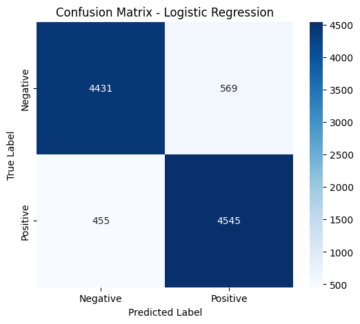

# 🎬 IMDb Sentiment Analysis
### TF-IDF + Machine Learning · 50,000 Reviews · 3 Models Compared

> Classifying movie reviews as **positive** or **negative** using classical NLP techniques —
> a clean, well-documented pipeline from raw text to production-ready model.


---

## 📊 Results at a Glance

| Model | Accuracy | Precision | Recall | F1 Score |
|---|---|---|---|---|
| 🥇 **Logistic Regression** | **89.76%** | 0.889 | 0.909 | 0.899 |
| 🥈 Linear SVC | 88.88% | 0.885 | 0.894 | 0.889 |
| 🥉 Naive Bayes | 86.40% | 0.853 | 0.880 | 0.866 |

**Logistic Regression wins** — best accuracy and highest recall, meaning it catches the most true positives.

---

## 🗂️ Repository Structure

```
imdb-sentiment-analysis/
├── IMDb_Sentiment_TFIDF_Comparison.ipynb   # Main notebook (all 12 cells)
├── requirements.txt                         # Python dependencies
├── README.md                                # This file
└── images/
    └── confusion_matrix.png                 # Logistic Regression confusion matrix
```

---

## 🧠 Pipeline Overview

```
Raw CSV
  └─► Text Cleaning        (HTML tags, lowercasing, non-alpha removal)
        └─► TF-IDF          (unigrams + bigrams, top 10k features, English stop words)
              └─► 80/20 Split  (stratified, 40k train / 10k test)
                    └─► 3 Models  (LR · NB · LinearSVC)
                          └─► Evaluation  (accuracy, F1, confusion matrix)
```

### Pipeline Details

| Step | What happens | Key parameters |
|---|---|---|
| **Text Cleaning** | Unescape HTML, strip tags, lowercase, remove non-alpha, collapse whitespace | — |
| **TF-IDF** | Fit on train only (no leakage), transform test | `ngram_range=(1,2)`, `max_features=10_000`, `stop_words='english'` |
| **Split** | Stratified shuffle | `test_size=0.2`, `random_state=42` |
| **Logistic Regression** | Best model | `max_iter=1000`, `n_jobs=-1` |
| **Naive Bayes** | Fast baseline | `MultinomialNB()` defaults |
| **LinearSVC** | Strong linear baseline | `max_iter=3000`, `dual='auto'` |

---

## 📈 Confusion Matrix — Logistic Regression

```
                  Predicted
                Negative  Positive
Actual Negative   4,431      569     ← 88.6% specificity
       Positive     455    4,545     ← 90.9% recall
```

- **True Negatives:** 4,431 — correctly called negative
- **True Positives:** 4,545 — correctly called positive
- **False Positives:** 569 — negative reviews called positive
- **False Negatives:** 455 — positive reviews missed (fewest errors here)



---

## 🎯 Custom Review Predictions

The trained model was tested on three hand-written reviews:

| Review (truncated) | Expected | Predicted | Confidence |
|---|---|---|---|
| *"This movie was absolutely fantastic! The acting, the plot, everything was perfect..."* | Positive | ✅ Positive | **94.3%** |
| *"Terrible waste of time. Boring script, horrible acting, and the sound was awful..."* | Negative | ✅ Negative | **100.0%** |
| *"The movie was okay. Some parts were interesting but it was too long and confusing..."* | Ambiguous | Negative | 86.1% |

The ambiguous review leans negative because words like *"too long"* and *"confusing"* carry strong negative TF-IDF weight.

---

## 🚀 Quickstart

### Run in Google Colab (recommended)

[](https://colab.research.google.com/github/Junaid-Ahmed-Rupok/imdb-sentiment-analysis/blob/main/IMDb_Sentiment_TFIDF_Comparison.ipynb)

> You'll need the [IMDb Dataset CSV](http://ai.stanford.edu/~amaas/data/sentiment/) uploaded to your Drive at:
> `MyDrive/DATASETS_For the data analysis/IMDB Dataset.csv`

### Run Locally

```bash
git clone https://github.com/Junaid-Ahmed-Rupok/imdb-sentiment-analysis.git
cd imdb-sentiment-analysis
pip install -r requirements.txt
jupyter notebook IMDb_Sentiment_TFIDF_Comparison.ipynb
```

### requirements.txt

```
pandas>=1.3.0
numpy>=1.21.0
scikit-learn>=1.0.0
matplotlib>=3.4.0
seaborn>=0.11.0
```

---

## 💾 Saved Artifacts

After a full run, the following are saved to `/content/imdb_sentiment/` (or your Drive):

| File | Description |
|---|---|
| `tfidf_vectorizer.pkl` | Fitted TF-IDF vectorizer — use this to transform new text |
| `logistic_regression_model.pkl` | Best-performing model |
| `model_comparison.csv` | Accuracy / precision / recall / F1 for all 3 models |
| `cleaned_imdb_reviews.csv` | Pre-cleaned dataset, ready to re-use without reprocessing |

---

## 📚 Dataset

- **Name:** IMDb Large Movie Review Dataset
- **Source:** [Stanford AI Lab](http://ai.stanford.edu/~amaas/data/sentiment/) — Maas et al., ACL 2011
- **Size:** 50,000 reviews — perfectly balanced (25k positive / 25k negative)
- **Format:** CSV with two columns: `review` (raw text) and `sentiment` (`positive` / `negative`)

---

## 🔑 Key Findings

1. **Logistic Regression ≈ LinearSVC** on this task (~1% gap) — both are strong linear classifiers on TF-IDF.
2. **Naive Bayes underperforms** by ~3% — its feature-independence assumption doesn't hold for sentiment phrases.
3. **Bigrams matter** — phrases like *"not good"*, *"very bad"*, *"would recommend"* are captured only with `ngram_range=(1,2)`.
4. **No class imbalance** — the perfectly balanced dataset means accuracy is a reliable metric here.
5. **Training is fast** — all three models train in under 4 seconds combined on a standard CPU.

---

## 🔮 Potential Next Steps

- **Word embeddings** — swap TF-IDF for Word2Vec, GloVe, or fastText
- **Transformer models** — fine-tune `distilbert-base-uncased` for a likely +5–8% accuracy gain
- **Cross-validation** — replace the single split with 5-fold CV for more reliable estimates
- **Preprocessing depth** — add lemmatization or stemming and measure impact
- **Ensemble** — combine LR + LinearSVC predictions via soft voting
- **Deployment** — wrap the saved `.pkl` files in a Streamlit or Gradio web app

---

## 📄 License

Educational use only. The IMDb dataset is provided by Stanford for non-commercial research.

---

## 👤 Author

**Junaid Ahmed Rupok**
[](https://github.com/Junaid-Ahmed-Rupok)

---

*⭐ Star this repo if it helped you learn NLP or get started with sentiment analysis.*


